# How It Works: The "Echo" Tracking Technique 🦇

This tool allows you to see when a user is **active** on WhatsApp or Signal without them knowing, and without them actually opening your chat.

It works using a digital "Side-Channel Attack" based on **Physics and Network Latency**.

## The Concept: "The Digital Pulse"

Imagine you are throwing a tennis ball against a wall:
1.  **If you are close to the wall**, the ball comes back instantly.
2.  **If you are far away**, the ball takes longer to return.

In the world of messaging apps:
*   **"Close to the Wall"** = The user has the app **OPEN** on their screen. Their phone is awake, the CPU is running at full speed, and the network connection is active.
*   **"Far Away"** = The phone is in their pocket (Standby). The screen is off, the processor is sleeping to save battery, and the WiFi radio is in low-power mode.

## The Trick: Measuring Speed (RTT) ⏱️

We don't hack their phone. We just measure **speed**.

1.  **The Probe**: The tool sends a specially crafted, invisible message to the target.
    *   *Technique:* It sends a "Delete Request" for a message that doesn't exist. This is invalid, but the phone **still has to process it** to say "I can't find that message".
2.  **The Echo**: The target's phone receives this request and automatically sends back a tiny receipt (Ack).
3.  **The Measurement**: We measure the time from **Send** to **Receive** (Round-Trip Time).

| User State | Phone Status | Reaction Speed |
| :--- | :--- | :--- |
| **🟢 Active** | Screen On, App Open, CPU High | **Fast (< 100ms)** |
| **🟡 Standby** | Screen Off, Low Power Mode | **Slow (> 500ms)** |

## The AI Brain: Adaptive Prediction 🧠

Every network is different. 100ms might be "Fast" on WiFi but "Slow" on 4G. Hardcoded numbers don't work.

This tool uses a machine learning algorithm called **K-Means Clustering**:

1.  **Collect Data**: It fires probes every few seconds and collects thousands of speed measurements.
2.  **Find Patterns**: It automatically notices two distinct groups of numbers:
    *   "There is a cluster of dots around 80ms." (Active)
    *   "There is a cluster of dots around 1200ms." (Standby)
3.  **Draw the Line**: It calculates a dynamic **Threshold** right in the middle.

```mermaid
graph LR
    A[Probe Sent] --> B{Target Phone}
    B -->|Fast Response| C(Online Cluster)
    B -->|Slow Response| D(Standby Cluster)
    C --> E[AI Analysis]
    D --> E
    E --> F[Status: 🟢 ONLINE]
```

## Is it detectable? 🕵️‍♂️

*   **For the Target**: No. The app suppresses notifications for these specific technical messages. Their phone doesn't ring or vibrate.
*   **For WhatsApp/Signal**: Maybe. If you probe too fast (e.g., 10 times a second), their servers might block you for spamming. That's why we use random intervals (Jitter) to look human.

## Summary

We are simply checking **"How fast can your phone answer a question?"**
*   **Fast Answer** = You are likely holding the phone.
*   **Slow Answer** = The phone is likely in your pocket.
